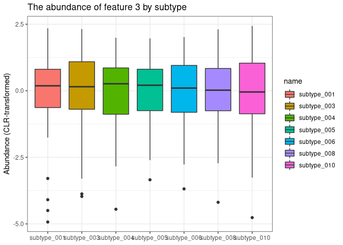

# argonaut

An R package about dealing with stratified feature tables.

Please note this package is under active development.

``` r
library(argonaut)
#make some dummy data
sdf <- dummy_strat(2, 3, 4, type = "seq")
 
head(sdf)
```

    ##                       X1 X2 X3 X4
    ## subtype_01|feature_01  1  7 13 19
    ## subtype_01|feature_02  2  8 14 20
    ## subtype_02|feature_01  4 10 16 22
    ## subtype_02|feature_02  5 11 17 23

``` r
#wrangle to stratifiedFeatureTable
as.stratifiedFeatureTable(sdf)
```

    ## An object of class "stratifiedFeatureTable"
    ## , , subtypes = subtype_01
    ## 
    ##        features
    ## samples feature_01 feature_02
    ##      X1          1          2
    ##      X2          4          5
    ##      X3          7          8
    ##      X4         10         11
    ## 
    ## , , subtypes = subtype_02
    ## 
    ##        features
    ## samples feature_01 feature_02
    ##      X1         13         14
    ##      X2         16         17
    ##      X3         19         20
    ##      X4         22         23

``` r
#argonaut is robust to incomplete input, for example when a microbe doesn't have a gene. 
sdf <- dummy_strat(10, 5, 6, type = "by_subtype", p_missing = 0.2)

head(sdf)
```

    ##                           X1   X2   X3    X4   X5   X6
    ## subtype_001|feature_01 11148 6294  690 14034 8808 1788
    ## subtype_001|feature_02  9290 5245  575 11695 7340 1490
    ## subtype_001|feature_03 11148 6294  690 14034 8808 1788
    ## subtype_001|feature_05  9290 5245  575 11695 7340 1490
    ## subtype_002|feature_01  3716 2958 1442  1476 3064 3110
    ## subtype_002|feature_02  1858 1479  721   738 1532 1555

``` r
head(as.stratifiedFeatureTable(sdf))
```

    ## , , subtypes = subtype_001
    ## 
    ##        features
    ## samples feature_01 feature_02 feature_03 feature_04 feature_05
    ##      X1      11148       9290      11148         NA       9290
    ##      X2       3716       1858       1608         NA       3716
    ##      X3       1854        309       1980         NA        309
    ##      X4       1200        268        720         NA       3960
    ##      X5       2250        720       6750         NA       1125
    ##      X6       8376       6750        837         NA       8376
    ## 
    ## , , subtypes = subtype_002
    ## 
    ##        features
    ## samples feature_01 feature_02 feature_03 feature_04 feature_05
    ##      X1       1395       6980         NA       1858        837
    ##      X2        171        279         NA        618        855
    ##      X3       6294        855         NA       1608       5245
    ##      X4       2958       5245         NA       1320       2958
    ##      X5        618       1479         NA       3375        103
    ##      X6       3430        103         NA       1396       5928
    ## 
    ## , , subtypes = subtype_003
    ## 
    ##        features
    ## samples feature_01 feature_02 feature_03 feature_04 feature_05
    ##      X1         66         34         NA       1395         33
    ##      X2       4728       2058         NA        684       4728
    ##      X3       2670        198         NA       1479       1602
    ##      X4         12       3940         NA        206         60
    ##      X5        690        534         NA        204        575
    ##      X6       1442         60         NA       1976       1442
    ## 
    ## , , subtypes = subtype_004
    ## 
    ##        features
    ## samples feature_01 feature_02 feature_03 feature_04 feature_05
    ##      X1         NA        575        513         99         NA
    ##      X2         NA        721       6294        788         NA
    ##      X3         NA       1300        204       2670         NA
    ##      X4         NA         77       2964         48         NA
    ##      X5         NA       2265       2058        721         NA
    ##      X6         NA       1704        198       2600         NA
    ## 
    ## , , subtypes = subtype_005
    ## 
    ##        features
    ## samples feature_01 feature_02 feature_03 feature_04 feature_05
    ##      X1         NA         NA       1602        462       1300
    ##      X2         NA         NA         36        846       2538
    ##      X3         NA         NA        690        852        284
    ##      X4         NA         NA        462       2743      16458
    ##      X5         NA         NA       1269       1200        720
    ##      X6         NA         NA       2265        512        640
    ## 
    ## , , subtypes = subtype_006
    ## 
    ##        features
    ## samples feature_01 feature_02 feature_03 feature_04 feature_05
    ##      X1       7800      13715       1704         NA         NA
    ##      X2       3775        240        720         NA         NA
    ##      X3        568        640        384         NA         NA
    ##      X4      16458      11695      14034         NA         NA
    ##      X5       1200        738       3666         NA         NA
    ##      X6        128       2337       1770         NA         NA
    ## 
    ## , , subtypes = subtype_007
    ## 
    ##        features
    ## samples feature_01 feature_02 feature_03 feature_04 feature_05
    ##      X1      14034        611       1812        738      11695
    ##      X2       1476       1812       1464       4674       1476
    ##      X3      14022       1464       1389       3666       2337
    ##      X4       3020       9810        366       1180       3540
    ##      X5        488        463       8808        732        244
    ##      X6      11772        610       6624       1962      11772
    ## 
    ## , , subtypes = subtype_008
    ## 
    ##        features
    ## samples feature_01 feature_02 feature_03 feature_04 feature_05
    ##      X1       2315       7340         NA       2315       1389
    ##      X2        122       1532         NA        488        610
    ##      X3       8808        184         NA       1532       7340
    ##      X4       3064       1104         NA        368       3064
    ##      X5       1104       1395         NA       6624        184
    ##      X6       2325       2400         NA       1248       3744
    ## 
    ## , , subtypes = subtype_009
    ## 
    ##        features
    ## samples feature_01 feature_02 feature_03 feature_04 feature_05
    ##      X1        800      10015       1872       1200        400
    ##      X2      12018        608       1395       2003      12018
    ##      X3       3040        390       2400       3040       1824
    ##      X4         78       1490       1824        312        390
    ##      X5       1788       1555        234       1555       1490
    ##      X6       3110        332       1788        664       3110
    ## 
    ## , , subtypes = subtype_010
    ## 
    ##        features
    ## samples feature_01 feature_02 feature_03 feature_04 feature_05
    ##      X1       1992        224       1344       1344        332
    ##      X2       2040       1224       2514       1676       5028
    ##      X3       3000       9000       1224       4500       1500
    ##      X4        372        310       9000         62        372
    ##      X5        370         74        222        370        222
    ##      X6         50        250        150        200        250

\#Apply_by()

``` r
#We can apply a function on the stratifiedFeatureTable with the apply_by() function. 

sft = as.stratifiedFeatureTable(sdf)

#MARGIN must be exactly 1, 2 or 3, corresponding to applying a function on all observations (1) per sample, (2) per feature or (3) per subtype.  

#for example, we can collapse to an unstratified feature table by summing all subtypes of the same feature. 
apply_by(X = sft, MARGIN = 3, FUN = sum)
```

    ##        features
    ## samples feature_01 feature_02 feature_03 feature_04 feature_05
    ##      X1      39550      48784      19995       9411      25276
    ##      X2      28046      10332      14031      11777      30969
    ##      X3      40256      14340       8271      19347      20441
    ##      X4      27162      33939      29370       6239      30802
    ##      X5       8508       9223      23007      14781       4663
    ##      X6      30633      14546      13632      10558      35262

\#Running statistical models on stratified feature tables

``` r
library(tidyverse)
```

    ## ── Attaching packages ─────────────────────────────────────── tidyverse 1.3.1 ──

    ## ✔ ggplot2 3.3.6     ✔ purrr   0.3.4
    ## ✔ tibble  3.1.7     ✔ dplyr   1.0.9
    ## ✔ tidyr   1.2.0     ✔ stringr 1.4.0
    ## ✔ readr   2.1.2     ✔ forcats 0.5.1

    ## ── Conflicts ────────────────────────────────────────── tidyverse_conflicts() ──
    ## ✖ dplyr::filter() masks stats::filter()
    ## ✖ dplyr::lag()    masks stats::lag()

``` r
y = rnorm(100)

x = dummy_strat(nsubtypes = 5, 
                nfeatures = 10, 
                nsamples = 100, 
                type = "by_subtype", 
                p_missing = .30) %>% 
  as.sft()

z = sample(LETTERS[1:3], 100, replace = T)


#The getFeature function extracts features by name or index and returns a table with each subtype of that feature, per sample. 

getFeature(x, "feature_003") %>% 
  Tjazi::clr_c(., samples_are = "rows") %>% 
  rownames_to_column("ID") %>% 
  pivot_longer(!ID) %>% 
  
  ggplot() +
  aes(x = name, y = value, fill = name) +
  geom_boxplot() +
  theme_bw() +
  ylab("Abundance (CLR-transformed)") + xlab(NULL) +
  ggtitle("The abundance of feature 3 by subtype")
```

<!-- -->

``` r
#getFeatures integrates with models and apply. 

#Run a model with each subtype as a predictor
lm(y ~ getFeature(x, 1) * z) %>% summary
```

    ## 
    ## Call:
    ## lm(formula = y ~ getFeature(x, 1) * z)
    ## 
    ## Residuals:
    ##      Min       1Q   Median       3Q      Max 
    ## -2.17360 -0.48368  0.02542  0.59814  1.72800 
    ## 
    ## Coefficients:
    ##                                 Estimate Std. Error t value Pr(>|t|)  
    ## (Intercept)                   -2.018e-01  2.272e-01  -0.888   0.3769  
    ## getFeature(x, 1)subtype_01     2.775e-05  5.629e-05   0.493   0.6233  
    ## getFeature(x, 1)subtype_02     4.794e-05  5.226e-05   0.917   0.3616  
    ## getFeature(x, 1)subtype_03    -1.746e-05  4.867e-05  -0.359   0.7206  
    ## getFeature(x, 1)subtype_04    -3.012e-05  6.815e-05  -0.442   0.6597  
    ## zB                            -2.766e-01  3.431e-01  -0.806   0.4225  
    ## zC                             1.535e-01  3.165e-01   0.485   0.6290  
    ## getFeature(x, 1)subtype_01:zB -1.796e-04  1.271e-04  -1.413   0.1612  
    ## getFeature(x, 1)subtype_02:zB  1.143e-04  1.036e-04   1.104   0.2729  
    ## getFeature(x, 1)subtype_03:zB  2.507e-04  9.956e-05   2.519   0.0137 *
    ## getFeature(x, 1)subtype_04:zB -1.368e-04  1.030e-04  -1.328   0.1877  
    ## getFeature(x, 1)subtype_01:zC -1.191e-04  7.823e-05  -1.522   0.1317  
    ## getFeature(x, 1)subtype_02:zC  3.406e-05  8.784e-05   0.388   0.6991  
    ## getFeature(x, 1)subtype_03:zC  7.352e-05  7.378e-05   0.996   0.3218  
    ## getFeature(x, 1)subtype_04:zC  8.068e-05  8.975e-05   0.899   0.3712  
    ## ---
    ## Signif. codes:  0 '***' 0.001 '**' 0.01 '*' 0.05 '.' 0.1 ' ' 1
    ## 
    ## Residual standard error: 0.8531 on 85 degrees of freedom
    ## Multiple R-squared:  0.2256, Adjusted R-squared:  0.09806 
    ## F-statistic: 1.769 on 14 and 85 DF,  p-value: 0.05692

``` r
#Run a model for each individual subtype
apply(X      = getFeature(x, 1), 
      MARGIN = 2, 
      FUN    = function(x){lm(y~x * z) %>% summary})
```

    ## $subtype_01
    ## 
    ## Call:
    ## lm(formula = y ~ x * z)
    ## 
    ## Residuals:
    ##      Min       1Q   Median       3Q      Max 
    ## -2.35193 -0.61802  0.05119  0.64413  2.45887 
    ## 
    ## Coefficients:
    ##               Estimate Std. Error t value Pr(>|t|)  
    ## (Intercept) -2.130e-01  1.961e-01  -1.087   0.2800  
    ## x            3.223e-05  3.912e-05   0.824   0.4120  
    ## zB           1.310e-01  3.062e-01   0.428   0.6698  
    ## zC           4.684e-01  2.740e-01   1.710   0.0906 .
    ## x:zB        -8.166e-05  1.025e-04  -0.796   0.4279  
    ## x:zC        -5.126e-05  5.808e-05  -0.883   0.3797  
    ## ---
    ## Signif. codes:  0 '***' 0.001 '**' 0.01 '*' 0.05 '.' 0.1 ' ' 1
    ## 
    ## Residual standard error: 0.901 on 94 degrees of freedom
    ## Multiple R-squared:  0.04455,    Adjusted R-squared:  -0.006268 
    ## F-statistic: 0.8767 on 5 and 94 DF,  p-value: 0.4999
    ## 
    ## 
    ## $subtype_02
    ## 
    ## Call:
    ## lm(formula = y ~ x * z)
    ## 
    ## Residuals:
    ##      Min       1Q   Median       3Q      Max 
    ## -2.26439 -0.53903  0.06362  0.64177  1.97696 
    ## 
    ## Coefficients:
    ##               Estimate Std. Error t value Pr(>|t|)
    ## (Intercept) -2.603e-01  1.923e-01  -1.354    0.179
    ## x            5.050e-05  4.193e-05   1.204    0.231
    ## zB          -1.191e-01  2.998e-01  -0.397    0.692
    ## zC           2.584e-01  2.689e-01   0.961    0.339
    ## x:zB         3.145e-05  7.295e-05   0.431    0.667
    ## x:zC         4.807e-05  7.069e-05   0.680    0.498
    ## 
    ## Residual standard error: 0.8774 on 94 degrees of freedom
    ## Multiple R-squared:  0.09396,    Adjusted R-squared:  0.04577 
    ## F-statistic:  1.95 on 5 and 94 DF,  p-value: 0.0934
    ## 
    ## 
    ## $subtype_03
    ## 
    ## Call:
    ## lm(formula = y ~ x * z)
    ## 
    ## Residuals:
    ##     Min      1Q  Median      3Q     Max 
    ## -2.1775 -0.5722  0.1621  0.6057  1.9512 
    ## 
    ## Coefficients:
    ##               Estimate Std. Error t value Pr(>|t|)  
    ## (Intercept) -1.362e-01  1.997e-01  -0.682   0.4969  
    ## x            8.802e-06  4.241e-05   0.208   0.8360  
    ## zB          -3.796e-01  2.999e-01  -1.266   0.2086  
    ## zC           1.058e-01  2.820e-01   0.375   0.7083  
    ## x:zB         1.261e-04  7.119e-05   1.771   0.0798 .
    ## x:zC         6.479e-05  6.052e-05   1.071   0.2871  
    ## ---
    ## Signif. codes:  0 '***' 0.001 '**' 0.01 '*' 0.05 '.' 0.1 ' ' 1
    ## 
    ## Residual standard error: 0.8681 on 94 degrees of freedom
    ## Multiple R-squared:  0.1132, Adjusted R-squared:  0.06605 
    ## F-statistic:   2.4 on 5 and 94 DF,  p-value: 0.04278
    ## 
    ## 
    ## $subtype_04
    ## 
    ## Call:
    ## lm(formula = y ~ x * z)
    ## 
    ## Residuals:
    ##     Min      1Q  Median      3Q     Max 
    ## -2.2575 -0.6682  0.1115  0.6594  2.1848 
    ## 
    ## Coefficients:
    ##               Estimate Std. Error t value Pr(>|t|)
    ## (Intercept) -1.206e-01  2.129e-01  -0.567    0.572
    ## x            4.792e-06  5.446e-05   0.088    0.930
    ## zB          -1.222e-01  3.046e-01  -0.401    0.689
    ## zC           2.374e-01  2.988e-01   0.795    0.429
    ## x:zB         2.325e-05  7.212e-05   0.322    0.748
    ## x:zC         2.317e-05  7.225e-05   0.321    0.749
    ## 
    ## Residual standard error: 0.9031 on 94 degrees of freedom
    ## Multiple R-squared:  0.0401, Adjusted R-squared:  -0.01095 
    ## F-statistic: 0.7854 on 5 and 94 DF,  p-value: 0.5627
