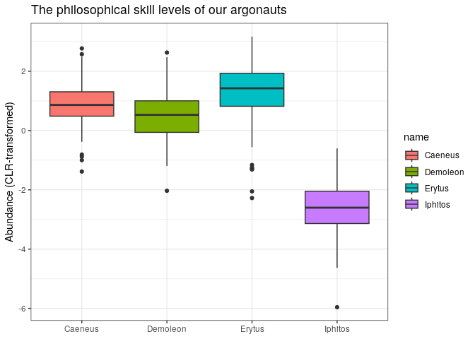

# argonaut

An R package about dealing with stratified feature tables.

Please note this package is under active development.

``` r
library(argonaut)
#make some dummy data
sdf <- dummy_strat(2, 3, 4, type = "seq")
 
head(sdf)
```

    ##                       X1 X2 X3 X4
    ## subtype_01|feature_01  1  7 13 19
    ## subtype_01|feature_02  2  8 14 20
    ## subtype_02|feature_01  4 10 16 22
    ## subtype_02|feature_02  5 11 17 23

``` r
#wrangle to stratifiedFeatureTable
as.stratifiedFeatureTable(sdf)
```

    ## An object of class "stratifiedFeatureTable"
    ## , , subtypes = subtype_01
    ## 
    ##        features
    ## samples feature_01 feature_02
    ##      X1          1          2
    ##      X2          7          8
    ##      X3         13         14
    ##      X4         19         20
    ## 
    ## , , subtypes = subtype_02
    ## 
    ##        features
    ## samples feature_01 feature_02
    ##      X1          4          5
    ##      X2         10         11
    ##      X3         16         17
    ##      X4         22         23

``` r
#argonaut is robust to incomplete input, for example when a microbe doesn't have a gene. 

#Let's switch it up and generate some more Argonauts with some heroic skills. 
sdf <- board_argo(nsubtypes = 10, nfeatures = 5, nsamples = 6, p_missing = 1/2)

head(sdf)
```

    ##                           X1   X2   X3   X4   X5   X6
    ## Amphidamas|Fishing       940 1044 2768 5864 6452 2624
    ## Erginus|Fishing         2440 2260 6785 9750 2810 5105
    ## Erginus|Natural history 1952 1808 5428 7800 2248 4084
    ## Erginus|Wrestling       2440 2260 6785 9750 2810 5105
    ## Erginus|History          488  452 1357 1950  562 1021
    ## Erginus|Disguise         976  904 2714 3900 1124 2042

``` r
head(as.stratifiedFeatureTable(sdf))
```

    ## , , subtypes = Amphidamas
    ## 
    ##        features
    ## samples Disguise Fishing History Natural history Wrestling
    ##      X1       NA     940      NA              NA        NA
    ##      X2       NA    1044      NA              NA        NA
    ##      X3       NA    2768      NA              NA        NA
    ##      X4       NA    5864      NA              NA        NA
    ##      X5       NA    6452      NA              NA        NA
    ##      X6       NA    2624      NA              NA        NA
    ## 
    ## , , subtypes = Castor
    ## 
    ##        features
    ## samples Disguise Fishing History Natural history Wrestling
    ##      X1       NA      NA     447             447        NA
    ##      X2       NA      NA     243             243        NA
    ##      X3       NA      NA    1950            1950        NA
    ##      X4       NA      NA    1650            1650        NA
    ##      X5       NA      NA    3081            3081        NA
    ##      X6       NA      NA    6024            6024        NA
    ## 
    ## , , subtypes = Clytius
    ## 
    ##        features
    ## samples Disguise Fishing History Natural history Wrestling
    ##      X1     1440    2160    1800              NA      2160
    ##      X2      608     912     760              NA       912
    ##      X3     1220    1830    1525              NA      1830
    ##      X4     1528    2292    1910              NA      2292
    ##      X5     3652    5478    4565              NA      5478
    ##      X6     1460    2190    1825              NA      2190
    ## 
    ## , , subtypes = Erginus
    ## 
    ##        features
    ## samples Disguise Fishing History Natural history Wrestling
    ##      X1      976    2440     488            1952      2440
    ##      X2      904    2260     452            1808      2260
    ##      X3     2714    6785    1357            5428      6785
    ##      X4     3900    9750    1950            7800      9750
    ##      X5     1124    2810     562            2248      2810
    ##      X6     2042    5105    1021            4084      5105
    ## 
    ## , , subtypes = Iphiclus
    ## 
    ##        features
    ## samples Disguise Fishing History Natural history Wrestling
    ##      X1     3300      NA      NA            3960      3300
    ##      X2     7950      NA      NA            9540      7950
    ##      X3     6100      NA      NA            7320      6100
    ##      X4     4235      NA      NA            5082      4235
    ##      X5     7250      NA      NA            8700      7250
    ##      X6     6200      NA      NA            7440      6200
    ## 
    ## , , subtypes = Iphitos
    ## 
    ##        features
    ## samples Disguise Fishing History Natural history Wrestling
    ##      X1       NA      NA      NA            1122      1496
    ##      X2       NA      NA      NA            1245      1660
    ##      X3       NA      NA      NA            2730      3640
    ##      X4       NA      NA      NA             993      1324
    ##      X5       NA      NA      NA              99       132
    ##      X6       NA      NA      NA            2589      3452
    ## 
    ## , , subtypes = Leitus
    ## 
    ##        features
    ## samples Disguise Fishing History Natural history Wrestling
    ##      X1       NA      NA      85              NA        NA
    ##      X2       NA      NA     361              NA        NA
    ##      X3       NA      NA     247              NA        NA
    ##      X4       NA      NA     145              NA        NA
    ##      X5       NA      NA     276              NA        NA
    ##      X6       NA      NA     313              NA        NA
    ## 
    ## , , subtypes = Palaemon
    ## 
    ##        features
    ## samples Disguise Fishing History Natural history Wrestling
    ##      X1     5559    3706      NA            1853      7412
    ##      X2     3204    2136      NA            1068      4272
    ##      X3     4950    3300      NA            1650      6600
    ##      X4     3051    2034      NA            1017      4068
    ##      X5     6042    4028      NA            2014      8056
    ##      X6     1719    1146      NA             573      2292
    ## 
    ## , , subtypes = Phronius
    ## 
    ##        features
    ## samples Disguise Fishing History Natural history Wrestling
    ##      X1       NA     508      NA            1524       762
    ##      X2       NA     150      NA             450       225
    ##      X3       NA      78      NA             234       117
    ##      X4       NA    1406      NA            4218      2109
    ##      X5       NA    1756      NA            5268      2634
    ##      X6       NA     684      NA            2052      1026

\#Apply_by()

``` r
#We can apply a function on the stratifiedFeatureTable with the apply_by() function. 

sft = as.stratifiedFeatureTable(sdf)

#MARGIN must be exactly 1, 2 or 3, corresponding to applying a function on all observations (1) per sample, (2) per feature or (3) per subtype.  

#for example, we can collapse to an unstratified feature table by summing all subtypes of the same feature. 
apply_by(X = sft, MARGIN = 3, FUN = sum)
```

    ##        features
    ## samples Disguise Fishing History Natural history Wrestling
    ##      X1    11275    9754    2820           10858     17570
    ##      X2    12666    6502    1816           14354     17279
    ##      X3    14984   14761    5079           19312     25072
    ##      X4    12714   21346    5655           20760     23778
    ##      X5    18068   20524    8484           21410     26360
    ##      X6    11421   11749    9183           22762     20265

\#Running statistical models on stratified feature tables

``` r
library(tidyverse)
```

    ## ── Attaching packages ─────────────────────────────────────── tidyverse 1.3.1 ──

    ## ✔ ggplot2 3.3.6     ✔ purrr   0.3.4
    ## ✔ tibble  3.1.7     ✔ dplyr   1.0.9
    ## ✔ tidyr   1.2.0     ✔ stringr 1.4.0
    ## ✔ readr   2.1.2     ✔ forcats 0.5.1

    ## ── Conflicts ────────────────────────────────────────── tidyverse_conflicts() ──
    ## ✖ dplyr::filter() masks stats::filter()
    ## ✖ dplyr::lag()    masks stats::lag()

``` r
set.seed(123)

y = rnorm(100)

x = board_argo(nsubtypes = 5, 
                nfeatures = 10, 
                nsamples = 100, p_missing = 0.3) %>% 
  as.sft()

z = sample(LETTERS[1:3], 100, replace = T)


#The getFeature function extracts features by name or index and returns a table with each subtype of that feature, per sample. 

getFeature(x, "Philosophy") %>% 
  Tjazi::clr_c(., samples_are = "rows") %>% 
  rownames_to_column("ID") %>% 
  pivot_longer(!ID) %>% 
  
  ggplot() +
  aes(x = name, y = value, fill = name) +
  geom_boxplot() +
  theme_bw() +
  ylab("Abundance (CLR-transformed)") + xlab(NULL) +
  ggtitle("The philosophical skill levels of our argonauts")
```

<!-- -->

``` r
#getFeatures integrates with models and apply. 

#Run a model with each subtype as a predictor
lm(y ~ getFeature(x, 1) * z) %>% summary
```

    ## 
    ## Call:
    ## lm(formula = y ~ getFeature(x, 1) * z)
    ## 
    ## Residuals:
    ##      Min       1Q   Median       3Q      Max 
    ## -1.98160 -0.61111 -0.06757  0.53362  2.18472 
    ## 
    ## Coefficients:
    ##                               Estimate Std. Error t value Pr(>|t|)  
    ## (Intercept)                  0.8488322  0.4881141   1.739   0.0855 .
    ## getFeature(x, 1)Caeneus     -0.0001526  0.0000676  -2.258   0.0264 *
    ## getFeature(x, 1)Demoleon     0.0007238  0.0004744   1.526   0.1307  
    ## getFeature(x, 1)Orpheus     -0.0003897  0.0002037  -1.913   0.0590 .
    ## zB                          -0.6314848  0.7243458  -0.872   0.3857  
    ## zC                          -0.5150449  0.6327448  -0.814   0.4179  
    ## getFeature(x, 1)Caeneus:zB   0.0001666  0.0001107   1.506   0.1357  
    ## getFeature(x, 1)Demoleon:zB -0.0013351  0.0006876  -1.942   0.0554 .
    ## getFeature(x, 1)Orpheus:zB   0.0005960  0.0003681   1.619   0.1090  
    ## getFeature(x, 1)Caeneus:zC   0.0001319  0.0001014   1.301   0.1968  
    ## getFeature(x, 1)Demoleon:zC -0.0011142  0.0006073  -1.835   0.0699 .
    ## getFeature(x, 1)Orpheus:zC   0.0004379  0.0002762   1.586   0.1164  
    ## ---
    ## Signif. codes:  0 '***' 0.001 '**' 0.01 '*' 0.05 '.' 0.1 ' ' 1
    ## 
    ## Residual standard error: 0.9054 on 88 degrees of freedom
    ## Multiple R-squared:  0.1255, Adjusted R-squared:  0.01613 
    ## F-statistic: 1.148 on 11 and 88 DF,  p-value: 0.3354

``` r
#Run a model for each individual subtype
apply(X      = getFeature(x, 1), 
      MARGIN = 2, 
      FUN    = function(x){lm(y~x * z) %>% summary})
```

    ## $Caeneus
    ## 
    ## Call:
    ## lm(formula = y ~ x * z)
    ## 
    ## Residuals:
    ##      Min       1Q   Median       3Q      Max 
    ## -2.22853 -0.54211 -0.02379  0.60815  2.24717 
    ## 
    ## Coefficients:
    ##               Estimate Std. Error t value Pr(>|t|)  
    ## (Intercept)  5.906e-01  3.044e-01   1.941   0.0553 .
    ## x           -1.268e-04  6.736e-05  -1.882   0.0629 .
    ## zB          -4.101e-01  4.510e-01  -0.909   0.3656  
    ## zC          -4.213e-01  4.110e-01  -1.025   0.3080  
    ## x:zB         1.048e-04  1.067e-04   0.982   0.3287  
    ## x:zC         9.466e-05  1.014e-04   0.933   0.3531  
    ## ---
    ## Signif. codes:  0 '***' 0.001 '**' 0.01 '*' 0.05 '.' 0.1 ' ' 1
    ## 
    ## Residual standard error: 0.9183 on 94 degrees of freedom
    ## Multiple R-squared:  0.03912,    Adjusted R-squared:  -0.01199 
    ## F-statistic: 0.7654 on 5 and 94 DF,  p-value: 0.577
    ## 
    ## 
    ## $Demoleon
    ## 
    ## Call:
    ## lm(formula = y ~ x * z)
    ## 
    ## Residuals:
    ##      Min       1Q   Median       3Q      Max 
    ## -2.04652 -0.65371 -0.02019  0.58385  2.25772 
    ## 
    ## Coefficients:
    ##               Estimate Std. Error t value Pr(>|t|)  
    ## (Intercept) -0.2396601  0.2788705  -0.859   0.3923  
    ## x            0.0007178  0.0004794   1.497   0.1376  
    ## zB           0.6740875  0.4506203   1.496   0.1380  
    ## zC           0.5690926  0.4007887   1.420   0.1589  
    ## x:zB        -0.0012048  0.0006605  -1.824   0.0713 .
    ## x:zC        -0.0011102  0.0006093  -1.822   0.0716 .
    ## ---
    ## Signif. codes:  0 '***' 0.001 '**' 0.01 '*' 0.05 '.' 0.1 ' ' 1
    ## 
    ## Residual standard error: 0.9151 on 94 degrees of freedom
    ## Multiple R-squared:  0.04581,    Adjusted R-squared:  -0.004945 
    ## F-statistic: 0.9026 on 5 and 94 DF,  p-value: 0.4829
    ## 
    ## 
    ## $Orpheus
    ## 
    ## Call:
    ## lm(formula = y ~ x * z)
    ## 
    ## Residuals:
    ##      Min       1Q   Median       3Q      Max 
    ## -2.39468 -0.58416 -0.05283  0.55959  2.10911 
    ## 
    ## Coefficients:
    ##               Estimate Std. Error t value Pr(>|t|)
    ## (Intercept)  0.5027223  0.3098211   1.623    0.108
    ## x           -0.0003087  0.0002045  -1.510    0.134
    ## zB          -0.4889529  0.4976591  -0.983    0.328
    ## zC          -0.4629726  0.4122580  -1.123    0.264
    ## x:zB         0.0003833  0.0003483   1.100    0.274
    ## x:zC         0.0003335  0.0002783   1.198    0.234
    ## 
    ## Residual standard error: 0.925 on 94 degrees of freedom
    ## Multiple R-squared:  0.02489,    Adjusted R-squared:  -0.02697 
    ## F-statistic:  0.48 on 5 and 94 DF,  p-value: 0.7904
